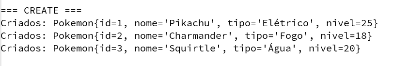
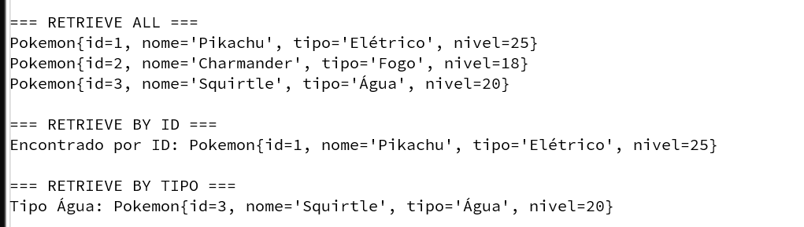

# Evidências — Atividade CRUD com ORM (ORMLite/SQLite)

Este documento comprova a execução bem-sucedida das operações CRUD na classe modelo `Pokemon` utilizando o ORMLite.

## 1. CREATE — Inserção de Dados
Os registros foram criados no banco de dados através do método `create()` do DAO.

## 2. RETRIEVE — Leitura de Dados
Os dados foram lidos do banco utilizando os métodos `queryForAll()` e `queryForId()`.

## 3. UPDATE — Atualização de Dados
O nível e o tipo do Pokemon foram alterados através do método `update()` do DAO.

## 4. DELETE — Exclusão de Dados
Um registro foi removido do banco de dados utilizando o método `deleteById()`.

## Conclusão
As quatro operações CRUD foram executadas com sucesso através do mapeamento objeto-relacional (ORM) com ORMLite e SQLite. O código demonstrou a persistência e manipulação dos dados sem a necessidade de escrever queries SQL manualmente.
